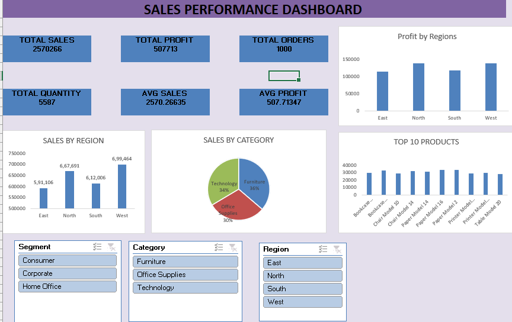

# Excel-Sales-Dashboard
Interactive Excel Sales Dashboard using Pivot Tables, Charts, and Slicers
# 📊 Excel Sales Dashboard

## 📌 Project Overview
This project is an interactive Sales Dashboard built using Microsoft Excel.

It helps analyze:
- Sales performance
- Profit trends
- Top products
- Regional performance

## 🛠 Tools Used
- Microsoft Excel
- Pivot Tables
- Pivot Charts
- Slicers

## 📊 Key Features
- KPI Cards (Sales, Profit, Orders, Quantity)
- Sales by Region
- Sales by Category
- Top 10 Products
- Interactive Slicers

## 📷 Dashboard Preview

## 🎯 Skills Demonstrated
- Data Analysis
- Data Visualization
- Dashboard Design
- Business Insights
